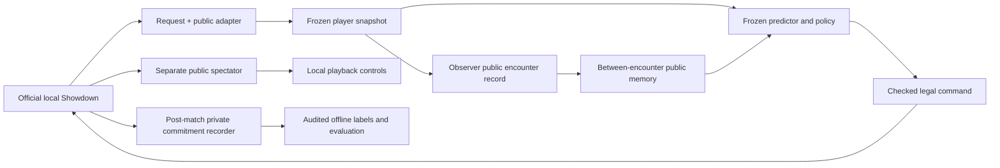

# Explaining BattleMind in an interview

## A defensible one-minute explanation

“I built a local Gen 1 Pokémon Showdown player and an experiment pipeline. The
official simulator owns the battle rules. My code freezes player-visible
observations, maps legal choices, records intended actions conservatively, and
tests whether opponent prediction affects a shared scoring policy. I compared
smoothed counts with logistic regression, then ran a bounded policy-parameter
search that included archived self-play opponents. I also implemented public-only
memory across encounters. Some prediction results improved, but battle improvement
was inconclusive, and both adaptation acceptance attempts stopped early. The final
demo makes the choices and limitations inspectable without a public service.”

## Trace one decision

The official engine sends a player's legal request and public protocol messages.
`adapter.py` copies these into nested frozen `DecisionSnapshot` values. The policy
can see its own legal moves and revealed opposing information; unknown moves,
unseen team members, private stats and Gen 1 effective-stat complications remain
unknown. Public HP preserves its received denominator. No live Battle object,
opponent current choice, runner identity, team-file ID or future result enters
the policy.

The frozen V4 logistic model predicts voluntary switching from supported visible
features. `LearnedScoreAgent` applies the selected V5 four-number vector to the
same approximate action utilities. V6, when used in its recorded experiment,
adjusts only the probability using a frozen summary of earlier completed public
encounters. The highest score wins, with legal request order breaking ties.
The returned semantic ID maps back through that same request's legal command
mapping. It is an approximate score, not a damage calculator or second simulator.

The viewer has no arrow back to policy inputs. Its controls change presentation.
The private recorder runs after clients stop and does not supply online features.
V4 fitting and V5 outcome updates are separate offline stages, not ongoing viewer
activity. Final evaluation never refits coefficients or optimizes parameters.

## What was learned, and what was written by hand?

| Component | Data changes | Fixed engineering/method |
|---|---|---|
| V3 counts | Global/context frequencies from eligible development records | Contexts, smoothing and shared score mixture |
| V4 supervised model | Logistic coefficients and train-only preprocessing | Compact visible features, regularized likelihood and declared validation search |
| V5 policy optimization | Four bounded action-score parameters from completed-game rewards | Antithetic proposals, update equation, opponent admission and separate selection/final phases |
| Archived self-play | Earlier frozen learned checkpoints contribute opponents/outcomes | Pool freezes within comparisons; no inference-time update |
| V6 pooled history | One observer's earlier public encounter residuals across sessions | Same residual/shrinkage/clipping rule as individual history |
| V6 individual history | That observer's public residuals for one synthetic opponent session | Opaque identity routing outside features; summaries frozen during battles |

Logistic regression, smoothing, derivative-free random-direction optimization and
clustered resampling are standard methods. BattleMind's contributions are the
information boundary, legal-action adapter, exact commitment alignment, conservative
public evidence rules, frozen common scorers, phase/budget accounting, compatibility
checks, replay audits and clear reporting. Do not claim a new optimizer or copy the
official simulator/renderer's work as your own.

## Why recording is difficult

An attempted send is not proof the engine committed it. A committed move may never
be announced; an announcement does not prove a hit. The post-match recorder matches
the exact official committed input sequences and preserves unknown suffixes after
mismatch. It joins the opponent label to the **observer's** earlier snapshot, not
to the choosing opponent's private features. Whole battles stay together in data
partitions. V6 further groups all encounters connected by shared memory.

Public announcements are a biased proxy for intended meaningful choice. Frozen,
asleep, locked, forced, ambiguous and unannounced actions create exclusions. V6
does not use private labels to repair memory; private evidence evaluates it only
offline. Each supported encounter has bounded weight so correlated turns are not
mistaken for many independent opponents.

## Why better probabilities did not establish better play

The probability changes only one part of a coarse utility approximation. Many
probability changes leave the highest-scoring action unchanged. Unknown switch
destinations use documented public/anonymous assumptions. Damage, long-term
position and effective Gen 1 stats are not modeled exactly. A better calibrated
switch estimate can still feed an inadequate action scorer.

V3 counts changed choices but worsened probability losses. V4 improved probability
quality on its declared mixture; battle benefit was inconclusive. V5 made real
outcome-driven updates, but its final interval included both regression and gain.
Both V6 acceptance attempts failed to finish. The first had an unrealistic phase
allocation plus reporting-accounting defects. The authorized repair fixed accounting
but hit a 300-turn freeze stalemate: the unchanged opponent heuristic preferred an
engine action over a healthy switch. Preserving that cap is more informative than
silently tuning the opponent or counting the cleanup forfeit as a win.

V6's partial final Brier scores favored individual memory, while switch-active
log loss worsened. Only one independent final group completed; the declared
four-group uncertainty is unavailable. That supports a functioning mechanism and
an identified limitation, not confirmed general adaptation benefit.

## Conservative resume wording

“Built a CPU-local Pokémon Showdown agent and auditable evaluation pipeline with
immutable observations, supervised opponent prediction, bounded policy optimization
against archived checkpoints, and public-only opponent memory; packaged frozen
artifacts and an offline animated demonstration while reporting negative and
incomplete experiments.”

Avoid competitive-strength, human-level play, novel reinforcement learning,
automatic improvement, or confirmed win-rate/adaptation improvement claims.
V7 ends the planned roadmap; further experiments require a new question and budget.
